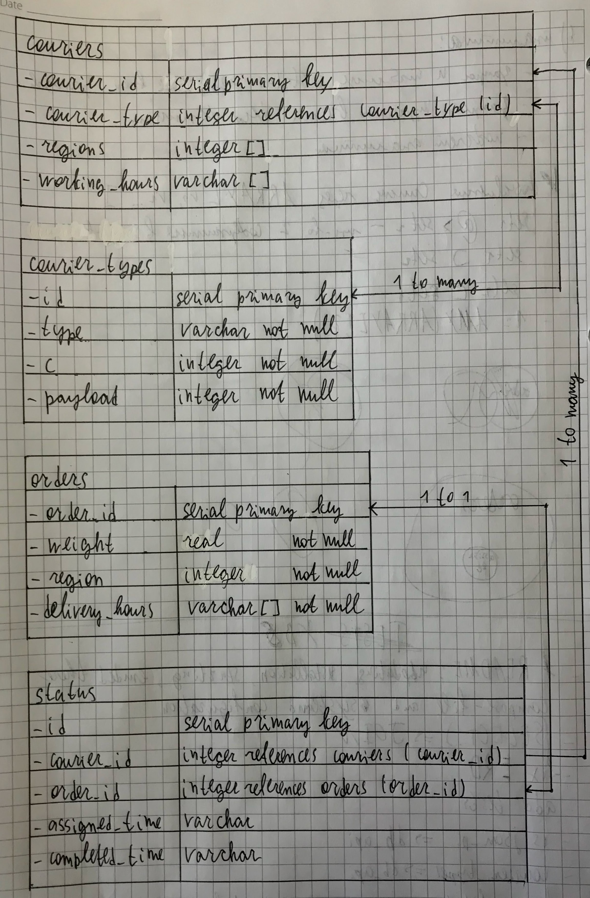

# _Candy Delivery App_ Documentation
Version 1.0

## Installing
1. Download the source code.
2. Create virtual environment and activate it:
```shell
python3 -m venv venv/
. venv/bin/activate
```
3. Install all requirements: `pip install -r requirements.txt`.
4. Create `.env` file:
```editorconfig
HOST='0.0.0.0'
PORT=8080
DEBUG=False
LOG_FOLDER=./logs/
DB_DSN='postgres://<user>:<password>@127.0.0.1:5432/candy_shop'
migrate=False
```
5. Create `docker-compose.yaml`:
```yaml
version: "3.7"

volumes:
  candy_shop:

services:
  database:
    image: postgres
    volumes:
      - /candy_shop/:/var/lib/postgresql/data
    restart: always
    environment:
      POSTGRES_PASSWORD: <password the same as in .env file>
      POSTGRES_USER: <user the same as in .env file>
      TZ: "Europe/Moscow"
    ports:
      - 127.0.0.1:5432:5432
```
6. Create file `/etc/systemd/system/candy_shop.service`:
```editorconfig
[Unit]
Description=CandyShop

[Service]
WorkingDirectory=/home/entrant/candy_shop/
ExecStart=/usr/bin/python3 src/server.py
ExecStartPre=/usr/bin/docker-compose -f docker-compose.yaml up -d
ExecStartPre=/bin/sleep 10
ExecReload=/usr/bin/python3 src/server.py
ExecStop=docker-compose stop
TimeoutSec=60
RestartSec=30
User=entrant
Restart=always

[Install]
WantedBy=multi-user.target
```


## Updating
From root project folder:
1. `git pull`. Make sure that you've connected to the severer via `ssh -A ...`
and you have access to the repository with your ssh-key.
2. `sudo service candy_shop restart` 


## Running
```shell
sudo service candy_shop start
```


## Docs
You can see docs, examples and try to use the service on `http://<host>:8080/swagger`.

ERD:



## Testing
Go to `tests/` folder and run tests:
```shell
pytest -svv tests/
```

> To run tests you must have database run.


## Benchmark
Also, you can see service productivity (RPS) and its performance.

1. Install benchmark soft
```shell
sudo apt install apache2-utils
```
2. Run benchmark
```shell
ab -n 5000 -c 500 http://<host>:8080/
```


## Requirements
* Python>=3.8
* docker-compose
* Required Python packages are in `requirements.txt`