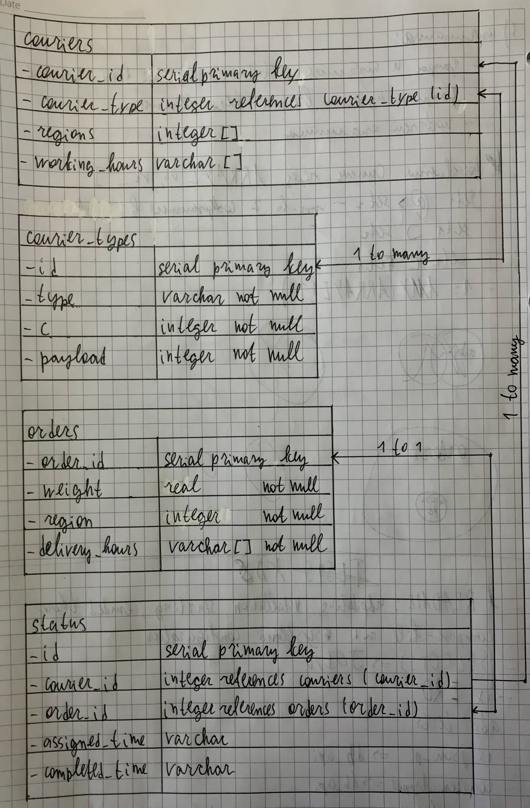

# Todo list
- [x] remove access to the server with password, use only SSH key
- [x] learn how to work with _sanic_ (_It's awfully easy_).
- [x] create ERD of the database
- [x] install and configure PostgreSQL
- [x] ~~install and configure pgbouncer~~ There's connection pool in aiopg/asyncpg, therefore pgbouncer is needless.
- [x] ~~install and configure ASGI~~ Application server is built into Sanic
- [ ] configure systemd to restart the service after rebooting
- [ ] learn `docker` library and use it to make tests 
- [x] learn `asyncpg`
- [ ] add mock tests
- [x] add benchmark
- [x] add swagger (`sanic-openapi`)
- [x] add README

